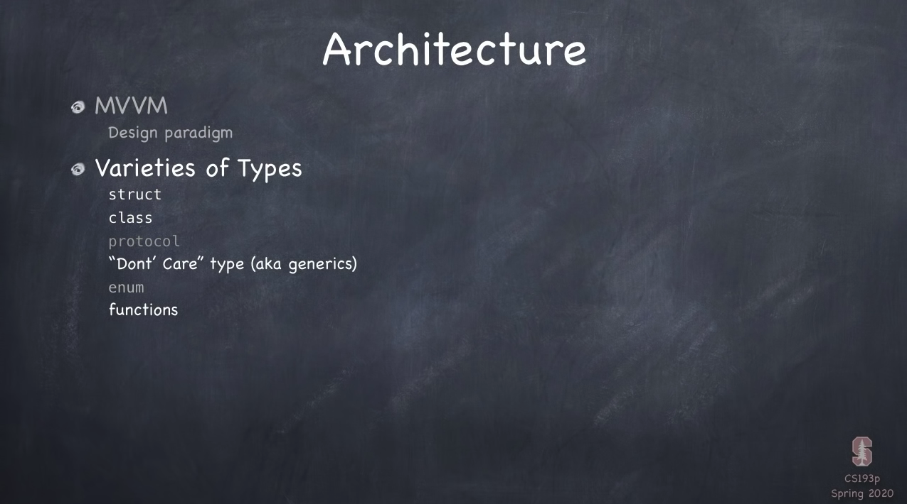
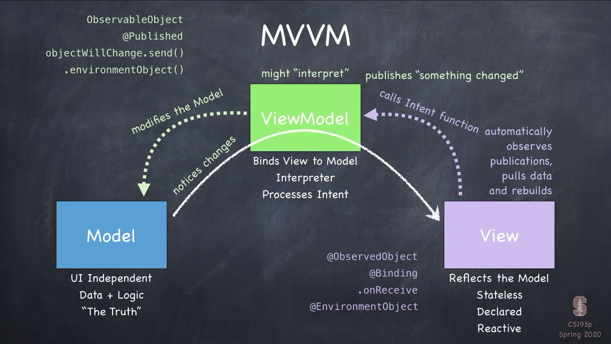
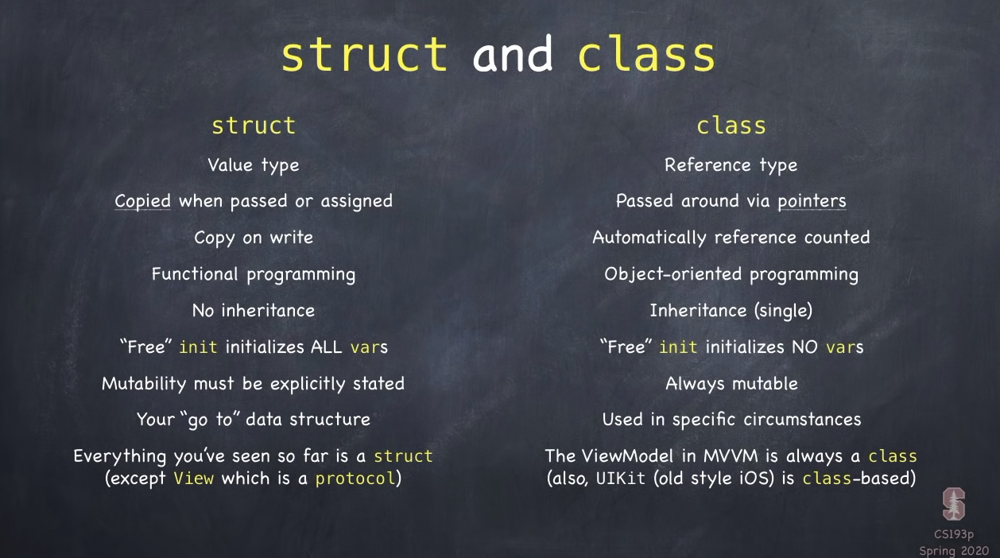

# [CS193p](https://cs193p.sites.stanford.edu/)

Stanford Lectures for developing iOS applications using SwiftUI.

스탠포드에서 제공되는 강의들을 따라하며, 과제들을 수행

## Lecture 2

Don't care type(aka generics)의 공식 명칭은 **Type Parameter** 이다.

